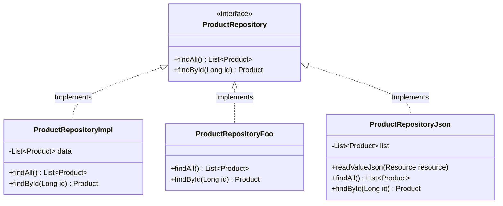

# 🚀 Spring Boot - Inversión de Control & Inyección de Dependencias (IoC & DI)

<div align="center">


<p align="center">
  <b>Una implementación de referencia para dominar el Contenedor IoC, Inyección de Dependencias, desacoplamiento de capas, configuración modular de Beans y patrones de diseño en Spring Boot.</b>
</p>

</div>

---

## 📑 Tabla de Contenidos

- [🌟 Visión General](#-visión-general)
- [🧠 Conceptos Clave Implementados](#-conceptos-clave-implementados)
  - [1. Inversión de Control (IoC) & DI por Constructor](#1-inversión-de-control-ioc--di-por-constructor)
  - [2. Desambiguación de Beans: `@Primary` vs `@Qualifier`](#2-desambiguación-de-beans-primary-vs-qualifier)
  - [3. Configuración Explícita con `@Configuration` & `@Bean`](#3-configuración-explícita-con-configuration--bean)
  - [4. Externalización de Configuración con `@PropertySource` & `@Value`](#4-externalización-de-configuración-con-propertysource--value)
  - [5. Inmutabilidad y Copia Defensiva con `Cloneable`](#5-inmutabilidad-y-copia-defensiva-con-cloneable)
  - [6. Alcances de Beans (Scopes)](#6-alcances-de-beans-scopes)
- [🏛️ Arquitectura del Sistema](#️-arquitectura-del-sistema)
  - [Diagrama de Flujo y Capas](#diagrama-de-flujo-y-capas)
  - [Patrón Strategy en la Capa de Datos](#patrón-strategy-en-la-capa-de-datos)
- [📂 Estructura del Proyecto](#-estructura-del-proyecto)
- [📡 API Reference & Endpoints](#-api-reference--endpoints)
  - [Listar Productos con Impuesto Calculado](#1-listar-todos-los-productos)
  - [Buscar Producto por ID](#2-buscar-producto-por-id)
- [🧪 Estrategias de Repositorio Disponibles](#-estrategias-de-repositorio-disponibles)
- [🛠️ Cómo Ejecutar el Proyecto](#️-cómo-ejecutar-el-proyecto)
- [🔄 Guía de Laboratorio: Cómo Intercambiar Implementaciones](#-guía-de-laboratorio-cómo-intercambiar-implementaciones)

---

## 🌟 Visión General

Este proyecto es una guía práctica y arquitectura limpia enfocada en comprender a fondo cómo el **Spring Framework** gestiona el ciclo de vida de los componentes, la resolución de dependencias y el desacoplamiento mediante **Inversión de Control (IoC)** e **Inyección de Dependencias (DI)**.

A través de un caso de negocio simple (gestión de catálogo de productos y cálculo dinámico de impuestos), el proyecto aborda los desafíos reales que surgen al construir software modular:

* ¿Cómo inyectar dependencias sin acoplarse a clases concretas?
* ¿Cómo resolver conflictos cuando existen múltiples implementaciones de una misma interfaz?
* ¿Cuándo usar estereotipos (`@Component`, `@Repository`, `@Service`) vs clases de configuración Java (`@Configuration`, `@Bean`)?
* ¿Cómo evitar efectos secundarios (side-effects) sobre los datos en memoria mediante inmutabilidad?
* ¿Cómo externalizar parámetros de negocio fuera del binario compilado?

---

## 🧠 Conceptos Clave Implementados

### 1. Inversión de Control (IoC) & DI por Constructor
Se abandona el uso directo de `new` en los consumidores. En lugar de crear sus colaboradores, `SomeController` y `ProductServiceImpl` declaran sus dependencias en el constructor:

```java
@RestController 
@RequestMapping("/api")
public class SomeController {

    private final ProductService service;

    // Inyección por constructor: Inmutable, testeable y sin dependencias mágicas
    public SomeController(ProductService service) {
        this.service = service;
    }
    ...
}
```

> 💡 **Best Practice aplicada**: La inyección por constructor es recomendada por el equipo de Spring sobre `@Autowired` en atributos (Field Injection), ya que permite declarar dependencias `final`, facilita pruebas unitarias sin levantar el contexto de Spring y previene dependencias circulares.

---

### 2. Desambiguación de Beans: `@Primary` vs `@Qualifier`
El sistema cuenta con **tres** implementaciones de la interfaz `ProductRepository`:

| Implementación | Calificador / Identificador | Rol |
| :--- | :--- | :--- |
| `ProductRepositoryImpl` | `@Repository("productList")` + `@Primary` | Implementación por defecto en memoria (List) |
| `ProductRepositoryFoo` | `@Repository("productFoo")` | Mock rápido con datos de prueba individuales |
| `ProductRepositoryJson` | Bean `"productJson"` | Proveedor de datos desacoplado que lee desde JSON |

Cuando coexisten múltiples beans del mismo tipo:
* `@Primary` define el bean preferido si no se especifica ningún calificador.
* `@Qualifier("nombreBean")` toma precedencia absoluta, seleccionando explícitamente la implementación deseada:

```java
public ProductServiceImpl(@Qualifier("productJson") ProductRepository repository) {
    this.repository = repository;
}
```

---

### 3. Configuración Explícita con `@Configuration` & `@Bean`
No todos los beans deben anotarse con `@Component`. Para clases de terceros o beans que requieren una inicialización parametrizada (como leer un archivo de recursos con Jackson), se utiliza una clase centralizada de configuración:

```java
@Configuration 
@PropertySource("classpath:config.properties")
public class AppConfig {

    @Value("classpath:json/product.json")
    private Resource resource;

    @Bean("productJson")
    public ProductRepository productRepositoryJson() {
        return new ProductRepositoryJson(resource);
    }
}
```

---

### 4. Externalización de Configuración con `@PropertySource` & `@Value`
El valor de la tasa impositiva (`TAX = 1.25`) no está hardcodeado en el código Java:
1. Se declara en `src/main/resources/config.properties`.
2. Se carga en el contexto mediante `@PropertySource("classpath:config.properties")`.
3. Se inyecta dinámicamente en el servicio:

```java
@Value("${app.value.TAX}")
private Double TAX;
```

Esto permite cambiar la tasa fiscal sin recompilar la aplicación.

---

### 5. Inmutabilidad y Copia Defensiva con `Cloneable`
Al aplicar el impuesto sobre la lista de productos obtenida del repositorio:

```java
@Override
public List<Product> findAll() {
    return repository.findAll().stream().map(p -> {
        Double priceTAX = p.getPrice() * TAX;
        
        // Copia defensiva mediante clonación para garantizar inmutabilidad
        Product newProduct = (Product) p.clone(); 
        newProduct.setPrice(priceTAX.longValue());
        return newProduct;
    }).collect(Collectors.toList());
}
```

> 🛡️ **¿Por qué esto es crucial?** Si modificáramos directamente `p.setPrice(...)`, alteraríamos la referencia original en la lista en memoria del repositorio. Si un usuario consultara el endpoint 3 veces seguidas, ¡el impuesto se aplicaría recursivamente! Clonar el objeto previene la mutación de estado no intencionada.

---

### 6. Alcances de Beans (Scopes)
El proyecto contiene exploraciones de ciclo de vida comentadas en los componentes:
* **Singleton (Default)**: Una única instancia compartida en todo el ApplicationContext.
* **`@RequestScope`**: Una instancia única creada para cada petición HTTP.
* **`@SessionScope`**: Una instancia vinculada a la sesión HTTP del usuario.

---

## 🏛️ Arquitectura del Sistema

### Diagrama de Flujo y Capas

```mermaid
graph TD
    Client(["🌐 Cliente HTTP / Browser"]) -->|GET /api| SC["SomeController\n(@RestController)"]
    SC -->|ProductService| PSI["ProductServiceImpl\n(@Service)"]
    
    subgraph Config ["Configuración & Entorno"]
        AC["AppConfig\n(@Configuration)"]
        CP[("config.properties\napp.value.TAX=1.25")]
        JSON[("product.json\nData Resource")]
        CP -.->|@Value| PSI
        JSON -.->|Resource| AC
    end

    AC -->|@Bean('productJson')| PRJ["ProductRepositoryJson"]

    subgraph Repositories ["Capa de Persistencia (Strategy Pattern)"]
        PR["«interface»\nProductRepository"]
        PRI["ProductRepositoryImpl\n(@Primary / 'productList')"]
        PRF["ProductRepositoryFoo\n('productFoo')"]
        PRJ
    end

    PR -.->|Implements| PRI
    PR -.->|Implements| PRF
    PR -.->|Implements| PRJ

    PSI -->|@Qualifier('productJson')| PRJ
```

---

## 📂 Estructura del Proyecto

```text
springboot-di/
├── mvnw                                      # Wrapper de Maven para Unix
├── mvnw.cmd                                  # Wrapper de Maven para Windows
├── pom.xml                                   # Configuración de dependencias (Spring Boot 4.x, Actuator, Web, DevTools)
└── src/
    ├── main/
    │   ├── java/com/gustavo/springboot/di/app/springboot_di/
    │   │   ├── SpringbootDiApplication.java  # Clase principal (Bootstrap de Spring Boot)
    │   │   ├── AppConfig.java                # Fábrica de Beans, PropertySource y carga de Resources
    │   │   │
    │   │   ├── controllers/
    │   │   │   └── SomeController.java       # Exposición de endpoints REST (/api)
    │   │   │
    │   │   ├── models/
    │   │   │   └── Product.java              # Entidad de dominio con soporte de clonación defensiva
    │   │   │
    │   │   ├── repositories/
    │   │   │   ├── ProductRepository.java    # Interfaz del contrato de persistencia
    │   │   │   ├── ProductRepositoryImpl.java# Implementación en memoria con ArrayList (@Primary)
    │   │   │   ├── ProductRepositoryFoo.java # Implementación Mock / Dummy
    │   │   │   └── ProductRepositoryJson.java# Implementación basada en Jackson y archivo JSON
    │   │   │
    │   │   └── services/
    │   │       ├── ProductService.java       # Contrato de lógica de negocio
    │   │       └── ProductServiceImpl.java   # Orquestador con inyección de repositorios y cálculo de TAX
    │   │
    │   └── resources/
    │       ├── application.properties        # Propiedades base de la aplicación
    │       ├── config.properties             # Parámetros de negocio externos (app.value.TAX)
    │       └── json/
    │           └── product.json              # Datos persistidos en formato JSON
    │
    └── test/
        └── java/com/gustavo/springboot/di/app/springboot_di/
            └── SpringbootDiApplicationTests.java # Prueba de carga de contexto
```

---

## 📡 API Reference & Endpoints

La API expone las siguientes rutas bajo el prefijo `/api`:

### 1. Listar todos los productos
Retorna la lista completa de productos con el impuesto (`TAX = 1.25`) ya calculado sobre el precio base.

* **Método:** `GET`
* **URL:** `/api`
* **Content-Type:** `application/json`

#### Ejemplo cURL:
```bash
curl -X GET http://localhost:8080/api
```

#### Respuesta Exitosa (`200 OK`):
```json
[
  {
    "id": 1,
    "name": "Play Station 5",
    "price": 14375
  },
  {
    "id": 2,
    "name": "Xbox Series X",
    "price": 13750
  },
  {
    "id": 3,
    "name": "Nintendo Switch 2",
    "price": 13750
  },
  {
    "id": 4,
    "name": "Steam Deck",
    "price": 12500
  }
]
```

---

### 2. Buscar producto por ID
Obtiene los detalles del producto por su identificador único (precio base sin mutación en el método directo).

* **Método:** `GET`
* **URL:** `/api/{id}`
* **Parámetros de Ruta:** `id` (Long, obligatorio)

#### Ejemplo cURL:
```bash
curl -X GET http://localhost:8080/api/1
```

#### Respuesta Exitosa (`200 OK`):
```json
{
  "id": 1,
  "name": "Play Station 5",
  "price": 11500
}
```

---

## 🧪 Estrategias de Repositorio Disponibles

El proyecto permite alternar entre 3 orígenes de datos distintos con solo cambiar una anotación:



1. **`ProductRepositoryJson`** *(Activa actualmente)*:
   - Carga y deserializa `product.json` usando Jackson (`ObjectMapper`).
   - Ideal para simular orígenes de datos externos desacoplados.
2. **`ProductRepositoryImpl`**:
   - Mantiene una lista en memoria (`Arrays.asList(...)`).
   - Posee `@Primary`, por lo que si se remueve `@Qualifier`, Spring inyectará automáticamente esta opción.
3. **`ProductRepositoryFoo`**:
   - Diseñado para pruebas rápidas / stubbing devolviendo `"Monitor Asus XD"`.

---

## 🛠️ Cómo Ejecutar el Proyecto

### Prerrequisitos
* **Java Development Kit (JDK):** Versión 17 o superior.
* **Maven:** 3.8+ (o utilizar el wrapper `./mvnw` incluido).

### Pasos

1. **Clonar el repositorio:**
   ```bash
   git clone https://github.com/GusDev071/Springboot-IoC.git
   cd Springboot-IoC
   ```

2. **Compilar el proyecto:**
   ```bash
   # En Windows PowerShell
   .\mvnw.cmd clean compile

   # En Linux / macOS
   ./mvnw clean compile
   ```

3. **Ejecutar la aplicación:**
   ```bash
   # En Windows PowerShell
   .\mvnw.cmd spring-boot:run

   # En Linux / macOS
   ./mvnw spring-boot:run
   ```

4. **Verificar que esté arriba:**
   Abre tu navegador o cliente HTTP favorito (Postman, Insomnia, Thunder Client) en:
   ```text
   http://localhost:8080/api
   ```

5. **Métricas de salud (Spring Boot Actuator):**
   ```text
   http://localhost:8080/actuator/health
   ```

---

## 🔄 Guía de Laboratorio: Cómo Intercambiar Implementaciones

Este proyecto fue diseñado para experimentar con DI en tiempo de desarrollo. Aquí hay 3 ejercicios prácticos:

### Ejercicio A: Usar la implementación por defecto (`@Primary`)
En [ProductServiceImpl.java](src/main/java/com/gustavo/springboot/di/app/springboot_di/services/ProductServiceImpl.java), remueve el `@Qualifier`:
```java
// Cambiar esto:
public ProductServiceImpl(@Qualifier("productJson") ProductRepository repository)

// Por esto:
public ProductServiceImpl(ProductRepository repository)
```
* **Resultado:** Spring resolverá automáticamente `ProductRepositoryImpl` gracias a la anotación `@Primary`.

---

### Ejercicio B: Inyectar la implementación Mock (`productFoo`)
Cambia el calificador al nombre del bean de prueba:
```java
public ProductServiceImpl(@Qualifier("productFoo") ProductRepository repository)
```
* **Resultado:** La API ahora devolverá el monitor Asus de prueba.

---

### Ejercicio C: Modificar la tasa de impuesto sin recompilar
Edita [src/main/resources/config.properties](src/main/resources/config.properties):
```properties
app.value.TAX = 1.50
```
Reinicia la aplicación y consulta `/api`. Los precios reflejarán inmediatamente un incremento del 50%.

---

<div align="center">

Hecho con precisión para aprender **Spring Boot IoC & DI** a fondo. 🚀

</div>
